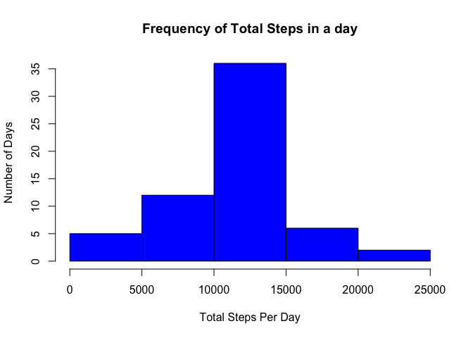

# Reproducible Research: Peer Assessment 1
========================================================

##Loading and preprocessing the data

```r
library(knitr);
rawdata <- read.csv("activity.csv")
adata <- na.omit(rawdata)
adata$date <- as.factor(as.character(adata$date)) # Removes date factors corresponding to NA values. 
```
##What is mean total number of steps taken per day?

```r
library(dplyr)
```

```
## 
## Attaching package: 'dplyr'
## 
## The following objects are masked from 'package:stats':
## 
##     filter, lag
## 
## The following objects are masked from 'package:base':
## 
##     intersect, setdiff, setequal, union
```

```r
dq1a <- adata %.%
        group_by(date) %.%
        summarize(totalsteps = sum(steps, na.rm = TRUE))

# Alternative Code for dq1a using TApply
# dqa <- tapply(adata$steps, adata$date, sum, na.rm = TRUE);
# dq1a <- cbind.data.frame(date = names(dqa),totalsteps = unname(dqa))

hist(dq1a[,2],
        xlab = "Total Steps Per Day",
	ylab = "Number of Days",
	main = "Frequency of Total Steps in a day",
        col = "red")
```

 

```r
meansteps <- mean(dq1a$totalsteps, na.rm = TRUE)
mediansteps <- median(dq1a$totalsteps, na.rm = TRUE)

print(sprintf("Mean total steps taken per day: %f ", meansteps))
```

```
## [1] "Mean total steps taken per day: 10766.188679 "
```

```r
print(sprintf("Median total steps taken per day: %f ", mediansteps))
```

```
## [1] "Median total steps taken per day: 10765.000000 "
```

##What is the average daily activity pattern ?

```r
dq2a <- adata %.%
        group_by(interval) %.%
	summarize(avgsteps = mean(steps))

# Alternative method to calculate dq2a
# dqa <- tapply(adata$steps, adata$interval, mean,na.rm = TRUE) 
# dq2a <- cbind.data.frame(interval = as.integer(names(dqa)),avgsteps = unname(dqa))

plot(dq2a$interval, 
	dq2a$avgsteps, 
	type = "l",
	xlab = "5-min Interval",
	ylab = "Average Num of Steps",
	main = "Average Daily Activity Pattern")
```

 

```r
maxavginterval = dq2a$interval[dq2a$avgsteps == max(dq2a$avgsteps)]

print(sprintf("5-min time Interval with maximum average steps taken per day: %i ", maxavginterval))
```

```
## [1] "5-min time Interval with maximum average steps taken per day: 835 "
```

##Imputing Missing Values

```r
nacount <- nrow(rawdata[!complete.cases(rawdata),])
print(sprintf("Row count with NA data: %i ", nacount))
```

```
## [1] "Row count with NA data: 2304 "
```
###     Strategy:
###Replace NA step values for corresponding intervals with mean interval values calculated above

```r
newdata <- rawdata
sapply(unique(rawdata$interval),
		function(x)
		newdata[!complete.cases(newdata) & (newdata$interval == x),1] <<- dq2a$avgsteps[dq2a$interval == x])
```

```
##   [1]   1.71698   0.33962   0.13208   0.15094   0.07547   2.09434   0.52830
##   [8]   0.86792   0.00000   1.47170   0.30189   0.13208   0.32075   0.67925
##  [15]   0.15094   0.33962   0.00000   1.11321   1.83019   0.16981   0.16981
##  [22]   0.37736   0.26415   0.00000   0.00000   0.00000   1.13208   0.00000
##  [29]   0.00000   0.13208   0.00000   0.22642   0.00000   0.00000   1.54717
##  [36]   0.94340   0.00000   0.00000   0.00000   0.00000   0.20755   0.62264
##  [43]   1.62264   0.58491   0.49057   0.07547   0.00000   0.00000   1.18868
##  [50]   0.94340   2.56604   0.00000   0.33962   0.35849   4.11321   0.66038
##  [57]   3.49057   0.83019   3.11321   1.11321   0.00000   1.56604   3.00000
##  [64]   2.24528   3.32075   2.96226   2.09434   6.05660  16.01887  18.33962
##  [71]  39.45283  44.49057  31.49057  49.26415  53.77358  63.45283  49.96226
##  [78]  47.07547  52.15094  39.33962  44.01887  44.16981  37.35849  49.03774
##  [85]  43.81132  44.37736  50.50943  54.50943  49.92453  50.98113  55.67925
##  [92]  44.32075  52.26415  69.54717  57.84906  56.15094  73.37736  68.20755
##  [99] 129.43396 157.52830 171.15094 155.39623 177.30189 206.16981 195.92453
## [106] 179.56604 183.39623 167.01887 143.45283 124.03774 109.11321 108.11321
## [113] 103.71698  95.96226  66.20755  45.22642  24.79245  38.75472  34.98113
## [120]  21.05660  40.56604  26.98113  42.41509  52.66038  38.92453  50.79245
## [127]  44.28302  37.41509  34.69811  28.33962  25.09434  31.94340  31.35849
## [134]  29.67925  21.32075  25.54717  28.37736  26.47170  33.43396  49.98113
## [141]  42.03774  44.60377  46.03774  59.18868  63.86792  87.69811  94.84906
## [148]  92.77358  63.39623  50.16981  54.47170  32.41509  26.52830  37.73585
## [155]  45.05660  67.28302  42.33962  39.88679  43.26415  40.98113  46.24528
## [162]  56.43396  42.75472  25.13208  39.96226  53.54717  47.32075  60.81132
## [169]  55.75472  51.96226  43.58491  48.69811  35.47170  37.54717  41.84906
## [176]  27.50943  17.11321  26.07547  43.62264  43.77358  30.01887  36.07547
## [183]  35.49057  38.84906  45.96226  47.75472  48.13208  65.32075  82.90566
## [190]  98.66038 102.11321  83.96226  62.13208  64.13208  74.54717  63.16981
## [197]  56.90566  59.77358  43.86792  38.56604  44.66038  45.45283  46.20755
## [204]  43.67925  46.62264  56.30189  50.71698  61.22642  72.71698  78.94340
## [211]  68.94340  59.66038  75.09434  56.50943  34.77358  37.45283  40.67925
## [218]  58.01887  74.69811  85.32075  59.26415  67.77358  77.69811  74.24528
## [225]  85.33962  99.45283  86.58491  85.60377  84.86792  77.83019  58.03774
## [232]  53.35849  36.32075  20.71698  27.39623  40.01887  30.20755  25.54717
## [239]  45.66038  33.52830  19.62264  19.01887  19.33962  33.33962  26.81132
## [246]  21.16981  27.30189  21.33962  19.54717  21.32075  32.30189  20.15094
## [253]  15.94340  17.22642  23.45283  19.24528  12.45283   8.01887  14.66038
## [260]  16.30189   8.67925   7.79245   8.13208   2.62264   1.45283   3.67925
## [267]   4.81132   8.50943   7.07547   8.69811   9.75472   2.20755   0.32075
## [274]   0.11321   1.60377   4.60377   3.30189   2.84906   0.00000   0.83019
## [281]   0.96226   1.58491   2.60377   4.69811   3.30189   0.64151   0.22642
## [288]   1.07547
```
### Plot Histogram of total steps with imputed data

```r
dqc <- tapply(newdata$steps, newdata$date, sum, na.rm = TRUE);
dq1c <- cbind.data.frame(date = names(dqc),totalsteps = unname(dqc))

hist(dq1c[,2],
	xlab = "Total Steps Per Day",
	ylab = "Number of Days",
	main = "Frequency of Total Steps in a day",
        col = "blue")
```

 

```r
meansteps <- mean(dq1c$totalsteps)
mediansteps <- median(dq1c$totalsteps)

print(sprintf("Mean total steps taken per day: %f ", meansteps))
```

```
## [1] "Mean total steps taken per day: 10766.188679 "
```

```r
print(sprintf("Median total steps taken per day: %f ", mediansteps))
```

```
## [1] "Median total steps taken per day: 10766.188679 "
```
##Are there differences in activity patterns between weekdays and weekends?

```r
newdata$date <- as.Date(newdata$date, "%Y-%m-%d")
newdata$weekend <- "weekday"
newdata$weekend[weekdays(newdata$date) %in% c("Saturday","Sunday")] <- "weekend"
newdata$weekend <- as.factor(newdata$weekend)

dq2a <- newdata %.%
		group_by(interval, weekend) %.%
		summarize(avgsteps = mean(steps))

library(ggplot2)
qplot(x = interval,
	y = avgsteps,
	data = dq2a,
	geom = c("line"),
	facets = weekend~.,
	ylab = "Average number of Steps")
```

 
